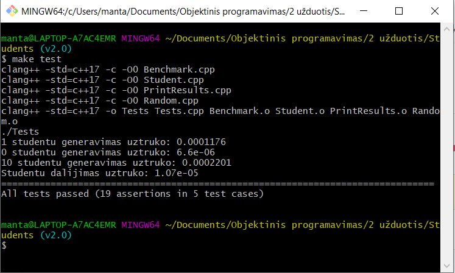

# Įdiegimo instrukcija:
1. Atsisiųskite norimą programos versiją iš „Releases“ skilties arba naudodami `git clone https://github.com/mxstrong/2-uzduotis-2.git` nusikopijuokite kodą į pasirinktą aplanką (senesnėms programos versijoms gauti eikite į [repozitoriją](https://github.com/mxstrong/2-uzduotis) arba naudokite `git clone https://github.com/mxstrong/2-uzduotis.git`).
2. Pasirinkite aplanką, kuriame yra jūsų norima versija ir jį atsidarykite komandinėje eilutėje.
2.1. Jei naudojate Windows, vietoj `make` visur galite naudoti `nmake`, kuris yra parsisiunčiamas kartu su Visual Studio arba Windows SDK, tereikia jį įtraukti į path. Taip pat galite naudoti ir `make` parsisiuntę Git Bash arba kitą aplinką, kuri palaiko Unix tipo komandas(reikės parsisiųsti ir įtraukti į path ir pačia `make` programą).
3. Unix sistemoje Paleiskite Makefile naudodami komandą `make` (Reikalingas clang kompiliatorius, jei jo neturite, atsisiųskite iš https://releases.llvm.org/download.html arba nurodykite kitą kompiliatorių: `make CC='[Kompiliatoriaus pavadinimas]'`(pvz. `make CC='g++'`)).
4. Pasileiskite programą naudodami komandą: `./[Paleidžiamojo failo vardas]` (Students, Deque, Deque-2, List, List-2, Vector arba Vector-2).

# Naudojimo instrukcija:
* Pasirinkite ar daryti programos veikimo laiko analizę.
  * Jei pasirinkote Taip: 
    * Įveskite kiek failų generuoti.
    * Įveskite kiek studentų turi buti kiekviename faile.
    * Įveskite failų vardus.
    * Pasirinkite ką naudosite galutinio balo skaičiavimui - vidurkį ar medianą.
  * Jei pasirinkote Ne:
    * Pasirinkite iš kur gauti pradinius duomenis.
      * Jei pasirinkote įvesti:
        * Pasirinkite kelių studentų duomenis norite įvesti.
        * Įveskite kiekvieno studento vardą, pavardę, namų darbų rezultatus ir egzamino pažymį.
        * Pasirinkite ką naudoti galutinio balo skaičiavimui (vidurkį ar medianą).
      \
     * Jei pasirinkote generuoti:
        * Pasirinkite kiek studentų sugeneruoti.
        * Įveskite norimo sugeneruoti failo vardą.
        * Pasirinkite ką naudoti galutinio balo skaičiavimui (vidurkį ar medianą).
      \
     * Jei pasirinkote skaityti iš failo:
        * Įveskite duomenų failo vardą.
        * Pasirinkite ką naudoti galutinio balo skaičiavimui (vidurkį ar medianą).

# Testavimo instrukcija:
Norint paleisti visus Unit testus pakanka iškviesti komandą `make test`(Unix aplinkoje) arba `nmake test`(Windows aplinkoje).

# Versijų istorija:
# [Versija v2.0](https://github.com/mxstrong/2-uzduotis-2/releases/tag/v2.0)
Naudojant Doxygen sugeneruota programos dokumentacija, ją peržiūrėti galite *doxygen* aplanke. Taip pat Tests.cpp faile pridėti testai pagrindinėms programos dalims naudojant Catch Unit testų karkasą.

# [Versija v1.5](https://github.com/mxstrong/2-uzduotis-2/releases/tag/v1.5)
Programoje pridėta nauja abstrakti bazinė klasė Person ir klasė Studentas dabar yra jos išvestinė klasė.

# [Versija v1.2.1](https://github.com/mxstrong/2-uzduotis-2/releases/tag/v1.2.1)
Programoje pridėti visi pagal trijų taisyklę reikalingi komponentai: destruktorius, copy assignmnent operatorius ir copy konstruktorius. Sutvarkyta programos veikimo laiko analizė, kur buvo lyginamos programos versijos su struktūromis ir su klasėmis, analizė taip pat papildyta paleidžiamųjų failų dydžiais.

# [Versija v1.2](https://github.com/mxstrong/2-uzduotis-2/releases/tag/v1.2)
Programoje Student klasei buvo perkrauti operatoriai, kurie ateityje gali būti naudingi programos naudotojams.

# [Versija v1.1](https://github.com/mxstrong/2-uzduotis-2/releases/tag/v1.1)
Programa buvo pertvarkyta, kad vietoj struktūtų būtų naudojamos klasės. Makefile buvo atnaujintas, kad būtų galima pasirinkti kitą kompiliatorių, o ne tik Clang, kuris naudojamas pagal nutylėjimą ir taip pridėta galimybė perduoti kompiliatoriui vėliavėles. Atitinkamai atnaujinta įdiegimo intrukcija. Pertvarkytas README.md failas, kad būtų patogiau jį skaityti.

## Realizacijų su struktūromis ir klasėmis spartos palyginimas naudojant skirtingas optimizavimo vėlevėles:

### Realizacija su struktūromis
Optimizavimo lygis | Studentų kiekis | Studentų generavimas | Failų generavimas | Studentų rikiavimas | Studentų dalijimas | Pažangių studentų surašymas į failą | Nepažangių studentų surašymas į failą | Visas programos veikimo laikas | Paleidžiamojo failo dydis
------------------ | --------------- | -------------------- | ----------------- | ------------------- | ------------------ | ------------------------------------- | ------------------------------------- | ------------------------------ | -------------------------
O0 | 100000 | 6.73916s | 1.45621s | 0.570331s | 0.077503s | 0.531293s | 0.538999s | 9.95746s | 458KB
O0 | 1000000 | 83.8462s | 22.1545s | 6.72674s | 0.749255s | 5.87053s | 5.83533s | 125.564s | 458KB
O1 | 100000 | 3.50226s | 1.15645s | 0.40941s | 0.0584391s | 0.466137s | 0.459245s | 6.09157s | 400KB
O1 | 1000000 | 24.4713s | 10.6706s | 35.6506s | 4.76623s | 6.70195s | 8.54418s | 91.113s | 400KB
O2 | 100000 | 1.21889s | 0.329366s | 0.143611s | 0.0210778s | 0.342192s | 0.353305s | 2.43204s | 429KB
O2 | 1000000 | 39.6863s | 11.0793s | 32.5561s | 4.47717s | 6.89511s | 6.29319s | 101.217s | 429KB
O3 | 100000 | 2.93946s | 0.765429s | 0.164651s | 0.0256045s | 0.36576s | 0.37604s | 4.66552s | 440KB
O3 | 1000000 | 13.9859s | 5.0145s | 1.54468s | 0.249171s | 3.51965s | 4.06141s | 28.5309s | 440KB

### Realizacija su klasėmis
Optimizavimo lygis | Studentų kiekis | Studentų generavimas | Failų generavimas | Studentų rikiavimas | Studentų dalijimas | Pažangių studentų surašymas į failą | Nepažangių studentų surašymas į failą | Visas programos veikimo laikas | Paleidžiamojo failo dydis
------------------ | --------------- | -------------------- | ----------------- | ------------------- | ------------------ | ------------------------------------- | ------------------------------------- | ------------------------------ | -------------------------
O0 | 100000 | 6.75161s | 1.46916s | 0.680596s | 0.105881s | 0.533922s | 0.510977s | 10.0971s | 464KB
O0 | 1000000 | 48.0846s | 10.7352s | 39.8295s | 3.88768s | 8.6775s | 8.72335s | 120.289s | 464KB
O1 | 100000 | 1.13401s | 0.407084s | 0.531654s | 0.052746s | 0.453532s | 0.441661s | 3.05413s | 403KB
O1 | 1000000 | 45.4831s | 17.251s | 6.96617s | 0.944574s | 5.00794s | 5.84517s | 81.8324s | 403KB
O2 | 100000 | 1.221s | 0.339112s | 0.191211s | 0.0227152s | 0.35602s | 0.417743s | 2.57344s | 436KB
O2 | 1000000 | 23.3462s | 7.21759s | 33.1877s | 4.55205s | 5.68103s | 6.86263s | 81.0308s | 436KB
O3 | 100000 | 1.22099s | 0.331038s | 0.168848s | 0.219151s | 0.442612s | 0.360744s | 2.5702s | 446KB
O3 | 1000000 | 31.9108s | 9.31849s | 2.96631s | 0.552289s | 3.71955s | 4.761s | 53.4402s | 446KB

# [Versija v1.0.1](https://github.com/mxstrong/2-uzduotis/releases/tag/v1.0.1)
Buvo atnaujinta programos sąsaja su vartotoju komandinėje eilutėje, taip pat minimaliai atnaujinta programos veikimo laiko analizė. Buvo sukurti nauji Makefile tam, kad programa veiktų Unix tipo sistemose. Sukūrus Makefile ir atnaujinus vartotojo sąsają atitinkamai buvo atnaujintos programos įdiegimo ir naudojimo instrukcijos.

# [Versija v1.0](https://github.com/mxstrong/2-uzduotis/releases/tag/v1.0)
Programa buvo pertvarkyta ir ženkliai optimizuota ir todėl atnaujintos programos spartos analizės. Programa dabar taiko 2 skirtingas strategijas studentams surūšiuoti į dvi grupes.

## Studentų rūšiavimo strategijų palyginimas:
1 strategija - studentų konteinerį padalinti į du konteinerius\
2 strategija - iš studentų konteinerio perkelti kriterijų atitinkančius studentus į naują konteinerį

Studentų kiekis | std::vector 1 strategija | std::vector 2 strategija | std::list 1 strategija | std::list 2 strategija | std::deque 1 strategija | std::deque 2 strategija
--------------- | ------------------------ | ------------------------ | ---------------------- | ---------------------- | ---------------------- | -----------------------
1000 | 0.0003923s | 0.0001764 | 0.0007535s | 0.0005547s | 0.0006412s |  0.0004933s
10000 | 0.0027093s | 0.0016226s | 0.0063385s | 0.0077404s | 0.0069454s | 0.0070327s
100000 | 0.0382856s | 0.0184986s | 0.146764s | 0.102567s | 0.0954378s | 0.0729289s
1000000 | 0.469434s | 0.241298s | 1.09972s | 1.14836s | 0.83865s | 0.769068s
10000000 | 4.23923s | 2.44195s | 9.35601s | 9.33468s | 11.5791s | 7.82477s

2 strategija daugeliu atvejų yra greitesnė, išskyrus su std::list, kur vykdymo laikas panašus ir su std::deque naudojant apie 10000 įrašų, bet su mažiau arba daugiau įrašų std::deque programos implementacija veikia šiek tiek greičiau naudojant 2 strategiją. Ženkliausi skirtumai pastebimi su std::vector, kur 2 strategija beveik du kartus greitesnė.

# [Versija v0.5](https://github.com/mxstrong/2-uzduotis/releases/tag/v0.5)
Programa dabar suskirstyta į 3 versijas, su skirtingomis duomenų struktūromis: std::vector, std::list ir std::deque.

## Programos veikimo laiko analizė, su skirtingomis duomenų struktūromis:

### std::vector:
Studentų kiekis | Duomenų nuskaitymas | Studentų rūšiavimas į dvi kategorijas | Visas laikas
--------------- | ------------------- | ------------------------------------- | ------------
1000 | 0.0056261s | 0.0003923s | 0.0060184s
10000 | 0.0460614s | 0.0027093s | 0.0487707s
100000 | 1.1548s | 0.0382856s | 1.1930856s
1000000 | 5.41935s | 0.469434s | 5.888784s
10000000 | 44.3545s | 4.23923s | 48.59373s

### std::list:
Studentų kiekis | Duomenų nuskaitymas | Studentų rūšiavimas į dvi kategorijas | Visas laikas
--------------- | ------------------- | ------------------------------------- | ------------
1000 | 0.0089173s | 0.0007535s | 0.0096708s
10000 | 0.0467701s | 0.0063385s | 0.0531086s
100000 | 1.22308s | 0.146764s | 1.369844s
1000000 | 6.05603s | 1.09972s | 7.15575s
10000000 | 47.787s | 9.35601s | 57.14301s

### std::deque:
Studentų kiekis | Duomenų nuskaitymas | Studentų rūšiavimas į dvi kategorijas | Visas laikas
--------------- | ------------------- | ------------------------------------- | ------------
1000 | 0.0102834s | 0.0006412s | 0.0109246s
10000 | 0.049512s | 0.0069454s | 0.0564574s
100000 | 1.20976s | 0.0954378s | 1.3051978s
1000000 | 5.60804s | 0.83865s | 6.44669s
10000000 | 50.1963s | 11.5791s | 61.7754s

Greičiausiai šioje programoje veikia std::vector duomenų struktūra, kitos duomenų struktūros šias užduotis atlieka lėčiau, o programos veikimo laiko augimas tarp struktūrų panašus.

# [Versija v0.4](https://github.com/mxstrong/2-uzduotis/releases/tag/v0.4)
Programa dabar gali pati sugeneruoti pradinių duomenų failus ir rezultatus dalina į dvi grupes: tuos kurių vidurkis >= 5 ir likusius.

## Programos veikimo laiko analizė:
Studentų kiekis | Studentų generavimas | Failų generavimas | Duomenų nuskaitymas | Studentų rikiavimas | Studentų rūšiavimas į dvi kategorijas | Pažangių studentų surašymas į failą | Nepažangių studentų surašymas į failą | Visas programos veikimo laikas
--------------- | -------------------- | ----------------- | ------------------- | ------------------- | ------------------------------------- | ----------------------------------- | ------------------------------------- | ------------------------------
1000 | 3.79208s | 0.0055796s | 0.0056261s | 0.0015246s | 0.0003923s | 0.0051052s | 0.00039824s | 17.2514s
10000 | 3.21854s | 0.0365878s | 0.0460614s | 0.0152302s | 0.0027093s | 0.0355636s | 0.0372222s | 13.7339s
100000 | 9.52402s | 0.786247s | 1.1548s | 0.421733s | 0.0382856s | 0.414563s | 0.307117s | 27.857s
1000000 | 29.3251s | 4.1484s | 5.41935s | 1.69674s | 0.469434s | 3.55203s | 3.61551s | 32.1945s
10000000 | 165.339s | 36.2581s | 44.3545s | 17.6408s | 4.23923s | 36.4908s | 42.16s | 164.168s

Bendras programos veikimo laikas auga šiek tiek mažiau kartų nei duomenų kiekis, todėl šis augimas yra logaritminis. Galima išskirti studentų rikiavimą ir rašymą į failus kaip greičiausiai augančias operacijas veikimo laiko prasme.

# [Versija v0.3](https://github.com/mxstrong/2-uzduotis/releases/tag/v0.3)
Programa pertvarkyta į daug mažesnių kodo bei antraščių failų ir pradėtos naudoti išimtys.

# [Versija v0.2](https://github.com/mxstrong/2-uzduotis/releases/tag/v0.2)
Programa gali nuskaityti duomenis ne tik iš įvesties, bet ir iš failo, arba juos sugeneruoti. Rezultatai surikiuojami pagal studentų vardus ir pavardes ir išvedami į failą.

# [Versija v0.1.2](https://github.com/mxstrong/2-uzduotis/releases/tag/v0.1.2)
Programa atnaujinta pakeičiant užsilikusius C masyvus į vektorius.

# [Versija v0.1.1](https://github.com/mxstrong/2-uzduotis/releases/tag/v0.1.1)
Programa atlaisvina dinamiškai paskirtą atmintį.

# [Versija v0.1](https://github.com/mxstrong/2-uzduotis/releases/tag/v0.1)
Programa nuskaito studentų vardus ir pavardes ir tada leidžia įvesti 
arba sugeneruoti atsitiktinai namų darbų ir egzaminų rezultatus, po to program
apskaičiuoja vidurkį arba medianą (pasirinktinai) ir išveda rezultatus.

# Spartos analizėms naudoto kompiuterio parametrai
CPU | RAM | SSD
--- | --- | ---
Intel CORE i5 8th Gen | 8GB | 256GB

